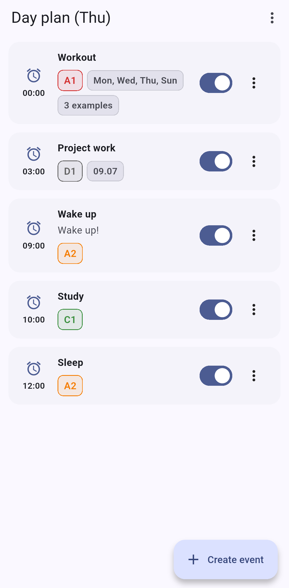
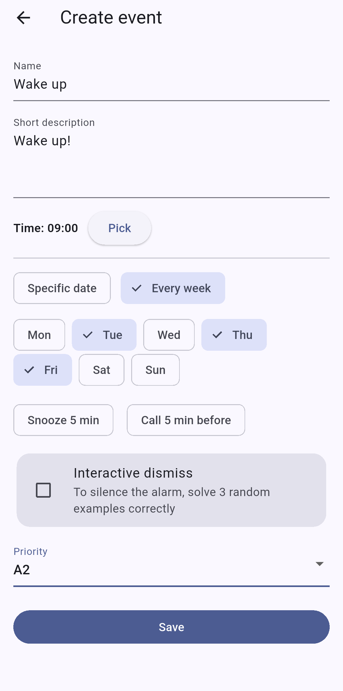
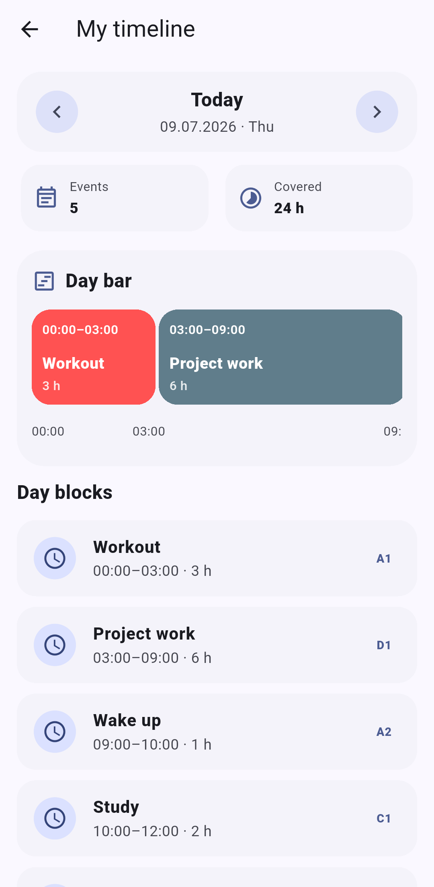
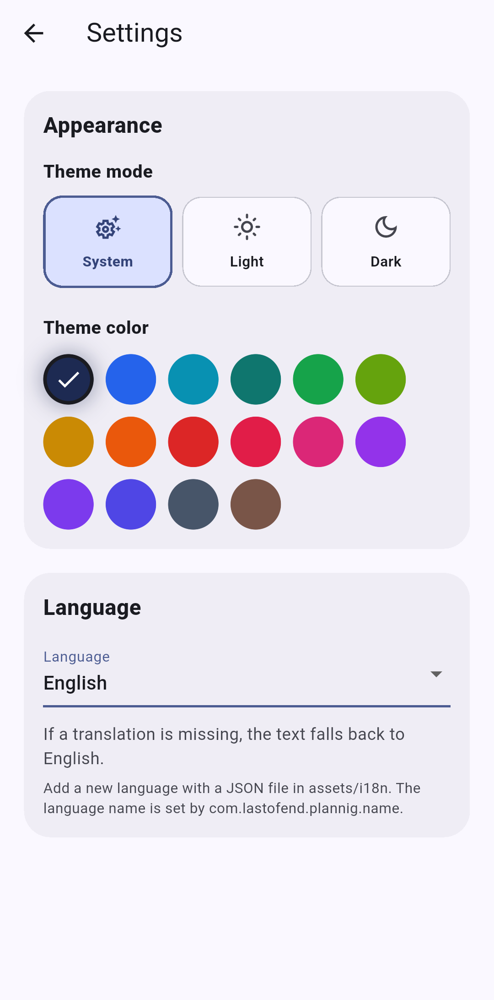
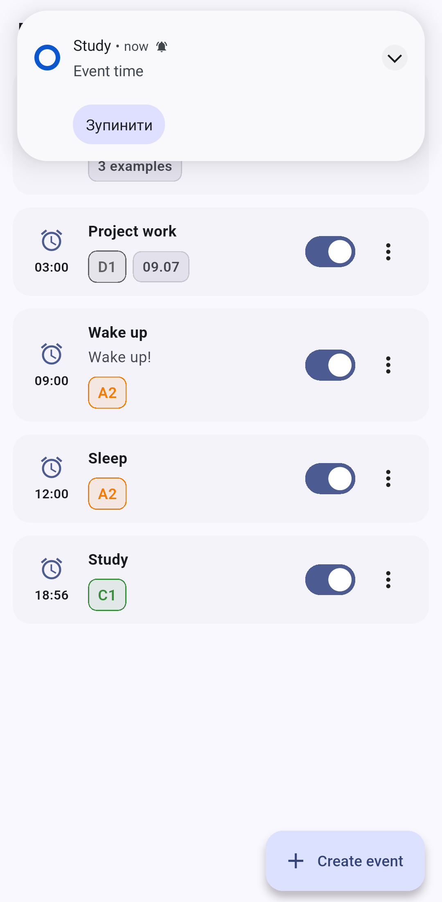

# Planning

**Planning** is a smart alarm and daily planning app built with Flutter.

The app helps you create daily and weekly events, receive alarm reminders, manage your day timeline, and protect alarm dismissal with interactive tasks.

## Features

- Smart alarms and reminders
- Daily and weekly event planning
- One-time events with custom dates
- Timeline view for the selected day
- Interactive alarm dismissal with math examples
- Snooze support
- Ukrainian and English language support
- Light, dark, and system theme modes
- Custom accent colors
- Backup export and import
- Android exact alarm support
- Notification diagnostics screen

## Screenshots

<p align="center">
  
  
  
</p>

<p align="center">
  
  
</p>

## Installation

You can download the latest APK from the **Releases** section:

> GitHub → Releases → Latest release → Download `.apk`

## Build from source

Make sure Flutter is installed.

```bash
flutter pub get
flutter build apk --release